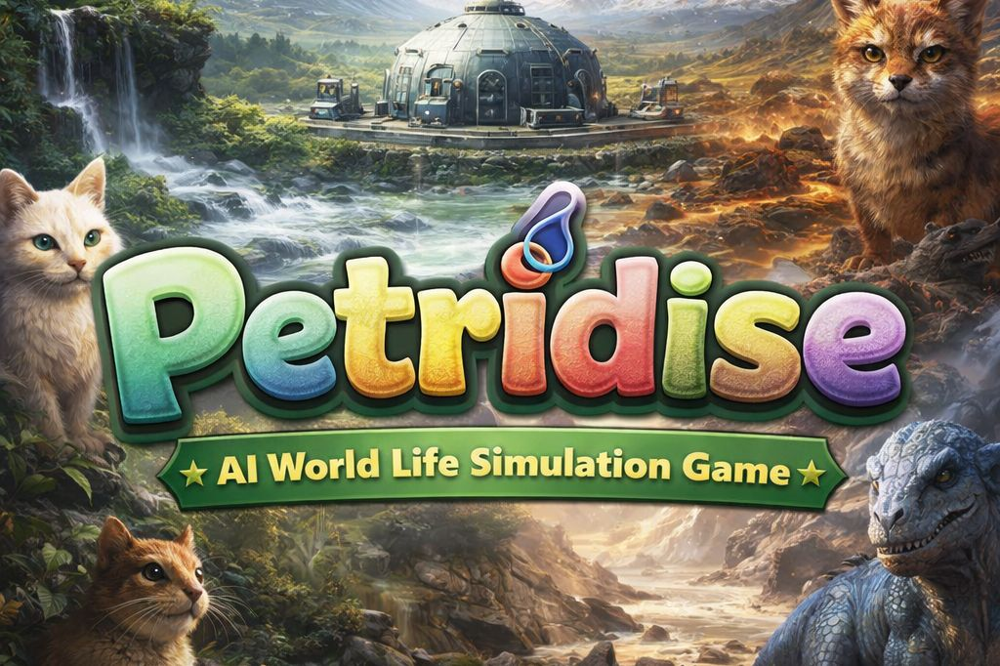
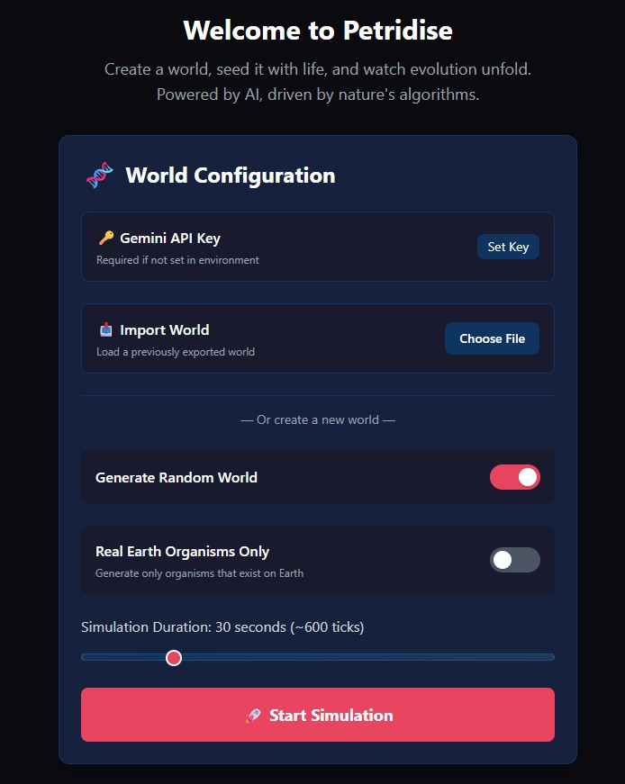
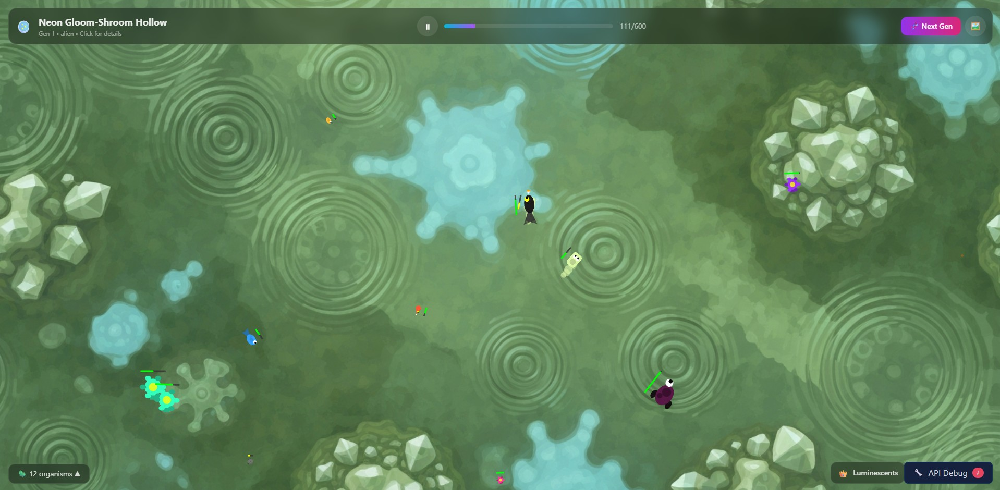
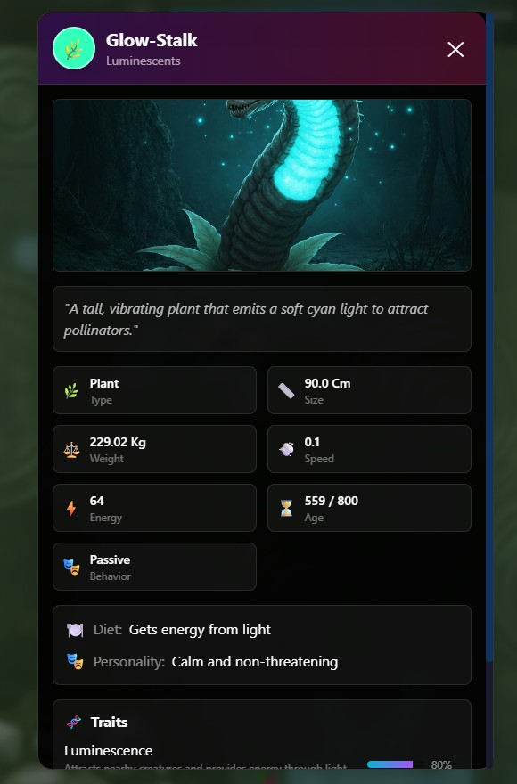

# 🧫 Petridise — Simulation Observation System



> _Create a world, seed it with life, and watch evolution unfold — powered by AI, driven by nature's algorithms._

**Petridise** is an AI-driven life simulation where Google Gemini generates entire ecosystems from scratch, renders them as living 2D terrariums, and then evolves them generation by generation. Configure your world's biome, atmosphere, and compounds, then sit back and observe as creatures move, interact, and evolve in real time.

🔗 **[Gemini 3 Hackathon — Devpost](https://gemini3.devpost.com/)**

---

## ✨ Features

| Feature                          | Description                                                                                                                                                   |
| -------------------------------- | ------------------------------------------------------------------------------------------------------------------------------------------------------------- |
| **AI World Generation**          | Gemini 3 Flash generates complete ecosystems — world parameters, organisms, traits, and a narrative — from a single prompt.                                   |
| **AI Image Generation**          | Imagen 4 creates unique background textures and organism portraits tailored to each biome.                                                                    |
| **Real-Time Simulation**         | Phaser.js renders organisms with locomotion-specific animations (swimming, hopping, flying, slithering…) and particle effects.                                |
| **AI-Powered Evolution**         | Between generations Gemini analyzes survival data, triggers events (mutations, extinctions, climate shifts), and produces new species with ancestry tracking. |
| **Rich Configuration**           | Customize gravity, temperature, humidity, atmospheric compounds, biome type, and simulation duration — or let the AI randomize everything.                    |
| **Real vs. Fictional Organisms** | Toggle between real Earth species and fantastical AI-invented creatures.                                                                                      |
| **Export / Import Worlds**       | Download your world as a JSON snapshot and import it later to continue evolving.                                                                              |
| **Immersive Aquarium Mode**      | Full-screen terrarium view that keeps organisms animating after the simulation completes.                                                                     |
| **API Debug Panel**              | Inspect every Gemini & Imagen request/response in a collapsible debug drawer.                                                                                 |
| **BYOK Support**                 | Bring-your-own Gemini API key from the UI — no server env var required.                                                                                       |

---

## � Screenshots

| World Configuration                                                                              | Live Simulation                                                                                                | Organism Details                                                                               |
| ------------------------------------------------------------------------------------------------ | -------------------------------------------------------------------------------------------------------------- | ---------------------------------------------------------------------------------------------- |
|                                                              |                                                                               |                                                         |
| Set your biome, atmosphere, compounds, and simulation duration — or let AI randomize everything. | Watch organisms move, interact, and compete in a Phaser.js-rendered terrarium with an AI-generated background. | Click any organism to inspect its traits, ancestry, diet, behavior, and AI-generated portrait. |

---

## �🖼️ How It Works

```
┌──────────────┐    POST /api/generate-world     ┌──────────────────┐
│  Config Panel │ ──────────────────────────────► │  Gemini 3 Flash  │
│  (React UI)   │ ◄────────────────────────────── │  (World + Orgs)  │
└──────┬───────┘    JSON: world, organisms        └──────────────────┘
       │
       │  POST /api/generate-texture
       │ ─────────────────────────────────►  Imagen 4 Fast
       │ ◄─────────────────────────────────  (Base64 background)
       │
       ▼
┌──────────────┐
│  Phaser.js   │   Real-time 2D simulation
│  Terrarium   │   with animated organisms
└──────┬───────┘
       │
       │  Simulation completes
       ▼
┌──────────────┐    POST /api/evolve              ┌──────────────────┐
│ Results Panel │ ──────────────────────────────► │  Gemini 3 Flash  │
│  (Stats +     │ ◄────────────────────────────── │  (Evolution AI)  │
│   Narrative)  │    Next-gen organisms + events   └──────────────────┘
└──────────────┘
```

---

## 🚀 Getting Started

### Prerequisites

- **Node.js** ≥ 18
- **pnpm** (recommended) or npm
- A **Google Gemini API key** — [get one here](https://aistudio.google.com/apikey)

### Installation

```bash
# Clone the repo
git clone https://github.com/ZechProjects/Petridise.git
cd petridise

# Install dependencies
pnpm install

# Create a .env file
echo "GEMINI_API_KEY=your_key_here" > .env
```

### Running Locally

```bash
# Development server (Express + Vite)
pnpm dev
```

This starts an Express dev server that proxies the Gemini/Imagen API calls and serves the Vite frontend at **http://localhost:3000**.

> **Tip:** You can also paste your API key directly in the UI under 🔑 _Gemini API Key_ — no `.env` file needed.

### Try Without an API Key

Don't have a Gemini API key? You can still explore Petridise by importing a pre-built world snapshot:

1. Download an example world from the [`example-worlds/`](example-worlds/) folder:
   - [world1-general.json](example-worlds/world1-general.json) — A general AI-generated ecosystem
   - [world2-earth.json](example-worlds/world2-earth.json) — An Earth-based biome with real organisms
2. In the Config Panel, click **Import World** and select the downloaded JSON file.
3. The simulation will load and run — no API key required!

> **Note:** Evolution between generations still requires a Gemini API key, but you can freely watch and interact with the imported simulation.

### Production Build

```bash
pnpm build
pnpm preview
```

### Deploy to Vercel

The project includes a `vercel.json` config with serverless functions under `/api`. Just push to your repo and connect it to Vercel:

```bash
vercel deploy
```

Set the `GEMINI_API_KEY` environment variable in your Vercel project settings.

---

## 🏗️ Architecture

```
petridise/
├── api/                          # Vercel serverless functions
│   ├── generate-world.ts         #   → Gemini 3 Flash: world + organisms
│   ├── generate-texture.ts       #   → Imagen 4 Fast: background image
│   ├── generate-organism-image.ts#   → Imagen 4 Fast: organism portraits
│   └── evolve.ts                 #   → Gemini 3 Flash: evolution engine
├── src/
│   ├── components/               # React UI
│   │   ├── ConfigPanel.tsx       #   World configuration form
│   │   ├── SimulationView.tsx    #   Phaser canvas + HUD
│   │   ├── ResultsPanel.tsx      #   Post-run stats & evolution
│   │   ├── SpeciesDetailPanel.tsx#   Organism detail modal
│   │   ├── WorldDetailPanel.tsx  #   World info panel
│   │   └── DebugPanel.tsx        #   API request inspector
│   ├── game/
│   │   └── MainScene.ts          # Phaser scene: rendering, physics, AI behaviors
│   ├── hooks/
│   │   └── useSimulation.ts      # Core state machine & API orchestration
│   ├── types/
│   │   └── index.ts              # Full TypeScript type definitions
│   └── utils/
│       └── index.ts              # Helpers
├── server.js                     # Local Express dev server (proxies APIs)
├── vercel.json                   # Vercel deployment config
└── package.json
```

---

## 🤖 Google Gemini API Usage

Petridise uses multiple Gemini models:

| Model                      | Endpoint                                 | Purpose                                                 |
| -------------------------- | ---------------------------------------- | ------------------------------------------------------- |
| **Gemini 3 Flash Preview** | `gemini-3-flash-preview:generateContent` | World generation, evolution analysis, narrative writing |
| **Imagen 4 Fast**          | `imagen-4.0-fast-generate-001:predict`   | Background textures, organism portrait images           |

All API calls use structured JSON output (`responseMimeType: "application/json"`) for reliable parsing.

---

## 🧬 World Configuration Options

| Parameter           | Range                                                                  | Description                          |
| ------------------- | ---------------------------------------------------------------------- | ------------------------------------ |
| Biome               | ocean, forest, desert, tundra, swamp, volcanic, grassland, cave, alien | Base environment type                |
| Temperature         | -50 °C – 100 °C                                                        | Ambient temperature                  |
| Humidity            | 0 – 100%                                                               | Moisture level                       |
| Gravity             | 0 – 5×                                                                 | World gravity multiplier             |
| Compounds           | O₂, H₂O, N₂, C, Minerals (0–100%)                                      | Atmospheric & surface composition    |
| Duration            | 10 – 120 s                                                             | Simulation run length per generation |
| Real organisms only | on / off                                                               | Restrict to real Earth species       |

---

## 🛠️ Tech Stack

- **Frontend:** React 18 · TypeScript · Vite · Tailwind CSS
- **Simulation Engine:** Phaser.js 3
- **AI:** Google Gemini 3 Flash · Imagen 4
- **Backend:** Vercel Serverless Functions (Node.js) · Express (local dev)
- **Package Manager:** pnpm

---

## 📜 License

This project is licensed under the [MIT License](LICENSE).

Built for the [Gemini 3 Hackathon](https://gemini3.devpost.com/).

---

<p align="center">
  <b>Petridise</b> © 2026 · Powered by Google Gemini AI · Built with React + Phaser
</p>
